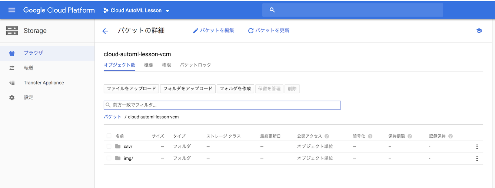
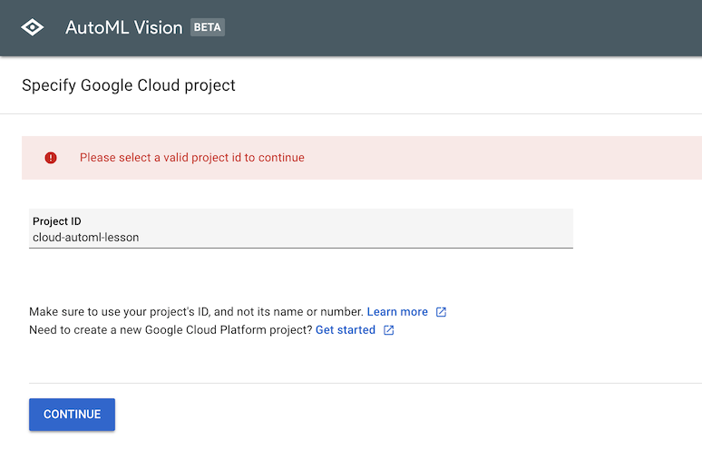

# Google Cloud AutoML Vision のクイックスタートメモ

## 参考：クイックスタートページ

当メモは、以下クイックスタートの手順を実際に実施した際の記録である。

* https://cloud.google.com/vision/automl/docs/quickstart

## 新規プロジェクトを作成

Google Cloud コンソールを開く

  * https://console.cloud.google.com/cloud-resource-manager

コンソール画面から "**プロジェクトを作成**" をクリックして、

  

"**Cloud AutoML Lesson**" という名前のプロジェクトを新規作成

  

プロジェクト ID は "**cloud-automl-lesson**" となる。

  

プロジェクトに対して課金が有効になっていることを確認（コンソール画面の **お支払い** メニューから）

  

Google Cloud Platform に **Google Cloud Storage Cloud AutoML API** と **Google Cloud Storage JSON API** のアプリケーションを登録（クイックスタートページの **ENABLE THE APIS** ボタンをクリック。クイックスタートを利用しない場合はどのような手順になるか？？？）

  

以下のような画面が表示されるので、"**Cloud AutoML Lesson**" プロジェクトを選択して **続行** をクリック。

  


## Cloud Storage バケットの作成

クイックスタートでは **Cloud Shell**（ GCP Console プロジェクトに接続されたブラウザベースの Linux コマンドライン、とのこと。ブラウザ上にターミナルのビューを開いて、Google Cloud の設定などの各種操作をコマンドで行える、というもの）から、以下のコマンドを実行、という手順だったが、
```
PROJECT=$(gcloud config get-value project) && BUCKET="${PROJECT}-vcm"
```
```
gsutil mb -p ${PROJECT} -c regional -l us-central1 gs://${BUCKET}
```
今回試した際には、このコマンドの実行に非常に時間がかかるようであったので、代わりに、以下のようにコンソール画面から手動で操作するようにした。

**Storage** メニューから "**ブラウザ**" を選択して、

  

**バケットを作成** をクリック。

  

バケット名は "**cloud-automl-lesson-vcm**" とする。

  

## AutoML Vision サービス アカウントの権限の追加

Google Cloud のコンソール画面に Cloud Shell のビューを表示する。画面右上のボタンをクリックする。

  

以下のようなビューがページ下部に表示される。

  

この Cloud Shell のビューから以下を入力する。
```
PROJECT=$(gcloud config get-value project)
```
```
gcloud projects add-iam-policy-binding $PROJECT \
   --member="serviceAccount:custom-vision@appspot.gserviceaccount.com" \
   --role="roles/ml.admin"
```
```
gcloud projects add-iam-policy-binding $PROJECT \
   --member="serviceAccount:custom-vision@appspot.gserviceaccount.com" \
   --role="roles/storage.admin"
```

しかしながら、以降の手順の中で、この設定が正常に適用されておらず（？）、再設定が必要になることがあった。
いったんは、クイックスタートの手順どおりの操作を行うこととする。

## バケットへのサンプル画像のコピー

Cloud Shell のビューから以下を入力する。
```
gsutil -m cp -R gs://cloud-ml-data/img/flower_photos/ gs://cloud-automl-lesson-vcm/img/
```
確かに時間がかかった。（ 1時間弱？）

## CSV ファイルを更新して、自分のバケット内のファイルを指すように調整

Cloud Shell のビューから以下を入力する。
```
gsutil cat gs://cloud-automl-lesson-vcm/img/flower_photos/all_data.csv | 
sed "s:cloud-ml-data:cloud-automl-lesson-vcm:" > all_data.csv
```

## バケットに CSV ファイルをコピー

Cloud Shell のビューから以下を入力する。
```
gsutil cp all_data.csv gs://cloud-automl-lesson-vcm/csv/
```

コマンド実行完了後、コンソール画面では以下のように表示される。

  

**img** ディレクトリは以下のようになっている。

  

**csv** ディレクトリには all_data.csv が配置されている状態となる。

  

この CSV ファイルの中身は、以下のように、ファイル名とそのラベルを設定したものである。
```
gs://cloud-automl-lesson-vcm/img/flower_photos/daisy/100080576_f52e8ee070_n.jpg,daisy
gs://cloud-automl-lesson-vcm/img/flower_photos/daisy/10140303196_b88d3d6cec.jpg,daisy
gs://cloud-automl-lesson-vcm/img/flower_photos/daisy/10172379554_b296050f82_n.jpg,daisy
gs://cloud-automl-lesson-vcm/img/flower_photos/daisy/10172567486_2748826a8b.jpg,daisy
・・・
gs://cloud-automl-lesson-vcm/img/flower_photos/dandelion/15219268336_f2460fca88_m.jpg,dandelion
gs://cloud-automl-lesson-vcm/img/flower_photos/dandelion/15268682367_5a4512b29f_m.jpg,dandelion
gs://cloud-automl-lesson-vcm/img/flower_photos/dandelion/15297244181_011883a631_m.jpg,dandelion
gs://cloud-automl-lesson-vcm/img/flower_photos/dandelion/15358221063_2c6e548e84.jpg,dandelion
・・・
gs://cloud-automl-lesson-vcm/img/flower_photos/roses/15061894841_e5aca59ecd_n.jpg,roses
gs://cloud-automl-lesson-vcm/img/flower_photos/roses/15094168139_8f636ffa1d_n.jpg,roses
gs://cloud-automl-lesson-vcm/img/flower_photos/roses/15104537437_f6730b38c3_n.jpg,roses
gs://cloud-automl-lesson-vcm/img/flower_photos/roses/15172358234_28706749a5.jpg,roses
・・・
```
独自に画像ファイルを用意して、それに対応する、このような CSV ファイルを合わせて作成すれば、独自の学習用データを用意できる、ということになるだろう。

## AutoML Vision ウェブサイトにアクセス

データセットの作成とモデルのトレーニングのプロセスを開始する前に、AutoML Vision ウェブサイトにアクセスする。

* http://beta-dot-custom-vision.appspot.com/

**Cloud AutoML Lesson** プロジェクトの ID を選択する。

  

以下のようなエラーメッセージが表示される場合は、**SET UP NOW** をクリックするとよい。

  

## データセットを作成

**NEW DATASET** をクリックして、新しいデータセット（学習結果が格納されるもの）を作成する。

  

データセット名を指定して、CSV ファイルのところに、先ほど配置した **all_data.csv** ファイルを、フルパスで指定する。

  

**CREATE DATASET** クリックののち、元データの読み込みがはじまる。

  

読み込み完了の状態。

  

## トレーニング（学習）開始

**TRAIN** タブをクリックし、**START TRAINING** をクリックする。

  

  

  * これもまあまあ時間がかかる。

## 結果検証

学習完了後、**EVALUATE** タブをクリックして、その結果を確認することができる。

  

## 推測

**PREDICT** タブでは、学習結果のモデルを利用して、任意の画像ファイルがどのようにラベル付けされるか、その推測の機能を試すことができる。

  

  

また この学習済みモデルでの推測処理は、REST API からも呼び出すことが可能である。＝＞ TODO